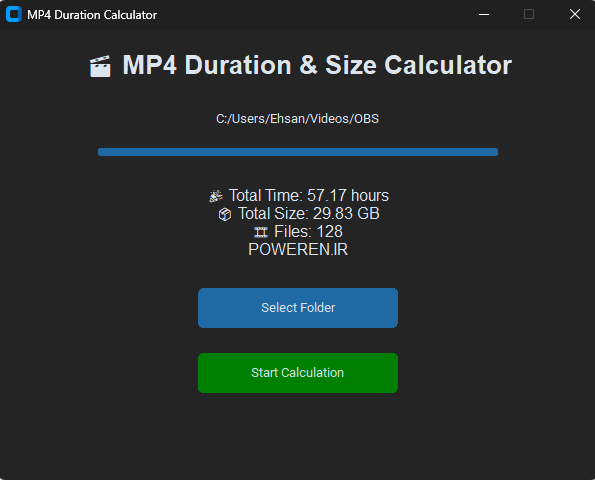

# 🎬 محاسبه‌گر زمان و حجم فایل‌های MP4

ابزاری سبک و کاربردی برای محاسبه مجموع زمان پخش و حجم کل فایل‌های ویدیویی MP4 داخل یک پوشه (به همراه زیرپوشه‌ها).

این نرم‌افزار با استفاده از Python، کتابخانه CustomTkinter و OpenCV توسعه داده شده است.

---

## 🚀 امکانات

- اسکن تمامی فایل‌های MP4 داخل یک پوشه و زیرپوشه‌ها  
- محاسبه مجموع زمان پخش ویدیوها (بر حسب ساعت)  
- محاسبه حجم کل فایل‌ها با نمایش خودکار MB / GB  
- نمایش نوار پیشرفت هنگام پردازش  
- رابط کاربری ساده، تیره و مدرن  
- اجرای سریع و سبک  

---

## 🖥 راهنمای استفاده

1. نرم‌افزار یا فایل EXE را اجرا کنید.  
2. روی گزینه **Select Folder** کلیک کنید.  
3. پوشه حاوی فایل‌های MP4 را انتخاب کنید.  
4. روی **Start Calculation** کلیک کنید.  
5. منتظر بمانید تا نوار پیشرفت کامل شود.  
6. مجموع زمان، حجم کل و تعداد فایل‌ها نمایش داده می‌شود.  

---

## 📦 نمونه خروجی

🎉 مجموع زمان: 12.45 ساعت  
📦 حجم کل: 18.32 گیگابایت  
🎞 تعداد فایل‌ها: 27  

---

## 🛠 تکنولوژی‌های استفاده‌شده

- Python  
- CustomTkinter  
- OpenCV  
- PyInstaller (برای ساخت خروجی EXE)  

---

## 🌐 قدرت گرفته از

POWEREN.IR
